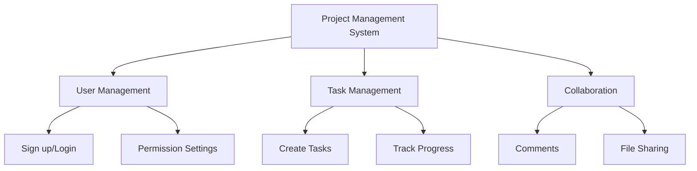

# CLAUDE.md

This file provides guidance to Claude Code (claude.ai/code) when working with code in this repository.

## Project Overview
Connect the Dot is a web-based mind mapping/note-taking application with a visual node-based interface. Users can create, connect, and organize notes as nodes in a starfield-themed canvas.

## Key Commands

### Development Commands
```bash
# Run the app locally (static HTML/JS)
python -m http.server 8000
# or
npx http-server

# Create backup
python backup.py
```

### Testing
Since this is a client-side JavaScript application without a build system, open `index.html` directly in a browser or use a local server.

## Architecture Overview

### Core Application Structure
The application uses vanilla JavaScript with modular architecture:

- **Firebase Integration**: Uses Firebase v11+ for authentication and data persistence
  - Firestore for node data storage
  - Firebase Auth for user management
  - Anonymous login support

- **Canvas System**: Multi-tab canvas system for managing different workspaces
  - Each canvas maintains independent node collections
  - Transform states (pan/zoom) are preserved per canvas
  - Tab management with rename and close functionality

- **Node System**: Core data structure for notes
  - Nodes have position, content, emotion states, folder associations
  - Links connect nodes to show relationships
  - Floating animation for visual appeal
  - Drag-and-drop support

### File Organization

#### JavaScript Modules (`/js/`)
- **Core Systems**:
  - `firebase-manager.js`: Firebase v11+ integration, auth, and data sync
  - `node-manager.js`: Node state management and operations
  - `canvas-tab-manager.js`: Multi-canvas tab system
  
- **UI Controllers**:
  - `editor-manager.js`: Rich text editor for node content
  - `folder-manager.js`: Folder hierarchy and organization
  - `canvas-controller.js`: Canvas rendering and interactions
  - `panel-manager.js`: Panel visibility and layout
  
- **Features**:
  - `calendar.js`: Calendar view for date-based notes
  - `spreadsheet.js`: Spreadsheet view for tabular data
  - `formatting-tools.js`: Text formatting utilities
  - `history-manager.js`: Undo/redo functionality

- **AI Features**:
  - `mermaid-parser.js`: Mermaid diagram parser (extracts nodes and links)
  - `ai-mermaid-converter.js`: AI-powered text to Mermaid converter (uses MCP ChatGPT)
  - `ai-mindmap-generator.js`: Automatic mindmap generation engine

- **Initialization**:
  - `app-initializer.js`: Application bootstrap (entry point)

#### CSS Modules (`/css/`)
Modular CSS architecture (see `/css/README.md` for details):
- `styles.css`: Main entry point importing all modules
- `variables.css`: CSS custom properties
- `base.css`: Reset and base styles
- `layout.css`: Layout and canvas system
- `components.css`: UI components
- `editor.css`: Editor-specific styles
- `features.css`: Feature-specific styles
- `ai-mindmap.css`: AI mindmap modal and UI styles
- `responsive.css`: Media queries and responsive design

### Key Implementation Details

#### Firebase Configuration
- Uses dynamic imports for Firebase v11+ modules
- Configuration stored in `firebase-manager.js`
- Supports email/password and anonymous authentication
- Real-time sync with Firestore

#### State Management
Global state object in `node-manager.js`:
```javascript
const state = {
    selectedNode: null,
    dragging: false,
    transform: { x: 0, y: 0, scale: 1 },
    selectedFolder: '/',
    history: { undoStack: [], redoStack: [] },
    calendar: { currentDate: new Date() }
}
```

#### Canvas Rendering
- Uses HTML/CSS for node rendering (not Canvas API)
- CSS transforms for pan/zoom
- RequestAnimationFrame for smooth animations

#### Data Persistence
- Nodes saved to Firebase Firestore per user
- Local storage for UI preferences
- Canvas states preserved across sessions

### Important Patterns

1. **Event Delegation**: Most events use delegation for dynamic content
2. **Debouncing**: Performance-critical operations are debounced
3. **WeakMap Usage**: Node metadata stored in WeakMap to prevent memory leaks
4. **Module Pattern**: Each JS file exports specific functionality
5. **CSS Variables**: Theming and consistent styling via CSS custom properties

### Security Considerations
- Firebase security rules should be configured server-side
- API keys are client-visible (normal for Firebase web apps)
- Input sanitization for user-generated content
- XSS prevention in rich text editor

### Performance Optimizations
- Lazy loading for non-critical features
- Debounced save operations
- CSS transforms for hardware acceleration
- WeakMap for metadata to allow garbage collection
- Request Animation Frame for smooth animations

### Browser Compatibility
- Targets modern browsers (ES6+)
- Uses CSS Grid and Flexbox
- Requires JavaScript enabled
- Mobile responsive design included

## AI-Powered Mindmap Generation

### Overview
The application includes an AI-powered feature that automatically converts text into structured mindmaps using Mermaid.js as an intermediate format.

### Architecture Flow
```
User Text Input
    ↓
AI Analysis (ChatGPT via MCP)
    ↓
Mermaid Diagram Generation
    graph TD
    A[Topic] --> B[Subtopic]
    ↓
Mermaid Parser
    ↓
Node & Link Creation
    ↓
Automatic Layout & Rendering
```

### Key Components

#### 1. Mermaid Parser (`mermaid-parser.js`)
- Parses Mermaid graph syntax (`graph TD`, `graph LR`)
- Extracts nodes: `A[Text]`, `B(Text)`, `C{Text}`
- Extracts links: `A --> B`, `A --- B`, `A -.- B`
- Returns structured data: `{nodes: [], links: []}`

#### 2. AI Converter (`ai-mermaid-converter.js`)
- **MCP Integration**: Uses `mcp__chatgpt__ask_chatgpt` function
- Converts natural language text to Mermaid format
- Structured prompting for consistent output
- Extracts Mermaid code blocks from AI response

**Example Prompt Structure**:
```javascript
const prompt = `Convert this text to Mermaid graph TD format:
${userText}

Rules:
- Nodes: A, B, C... naming
- Use --> for arrows
- Use [brackets] for labels
- Show clear hierarchy
`;
```

#### 3. Mindmap Generator (`ai-mindmap-generator.js`)
- **Core Functionality**:
  - Creates new canvas tab automatically
  - Converts Mermaid nodes to actual node objects
  - **Converts Mermaid arrows to actual visual links** (key feature)
  - Applies automatic tree layout algorithm

- **Layout Algorithm**:
  - BFS (Breadth-First Search) for level grouping
  - Hierarchical tree layout with automatic spacing
  - Root node detection (nodes with no incoming links)
  - Horizontal spacing: 300px, Vertical spacing: 250px
  - Color coding by depth level

- **Link Creation**:
```javascript
// Mermaid: A --> B
// Becomes:
links.push({
    from: nodeObjectA,  // Actual node reference
    to: nodeObjectB     // Actual node reference
});
// Renders as visual connection line
```

### User Interface

#### AI Button
- Location: Right button group (🤖 icon)
- Opens modal dialog for text input

#### Modal Features
- **Text Input**: Multi-line textarea with placeholder examples
- **File Upload**: Supports .txt and .md files
- **Options**:
  - Auto-link generation (creates connections between related nodes)
  - Smart layout (automatic positioning)
- **Progress Indicator**: Shows AI analysis status

### Usage Example

**Input Text**:
```
Project Management System
- User Management
  - Sign up/Login
  - Permission Settings
- Task Management
  - Create Tasks
  - Track Progress
- Collaboration
  - Comments
  - File Sharing
```

**Generated Mermaid**:


**Result**:
- New canvas tab created with title "Project Management System"
- 10 nodes automatically positioned in hierarchical layout
- 9 visual links connecting parent to child nodes
- Color-coded by depth (yellow → cyan → red)

### MCP Requirements

The AI mindmap feature requires the MCP ChatGPT server to be configured and running:

```javascript
// Check if MCP is available
typeof mcp__chatgpt__ask_chatgpt === 'function'
```

**Configuration**: See MCP server setup in user's environment settings

### Error Handling

- **No Text Input**: Alert user to enter text
- **MCP Unavailable**: Clear error message with fallback suggestion
- **Invalid Mermaid**: Validation before parsing
- **Parsing Errors**: Graceful degradation with error logging

### Performance

- **Processing Time**: < 5 seconds for typical inputs
- **Token Usage**: ~500-2000 tokens depending on text complexity
- **Layout Calculation**: O(n) where n = number of nodes
- **Memory**: Efficient with WeakMap for node metadata

### Future Enhancements

Potential improvements:
- Support for other diagram types (flowchart, sequence)
- Custom layout algorithms (radial, force-directed)
- Manual adjustment of auto-generated nodes
- Export to various formats (PNG, SVG, JSON)
- Template library for common structures